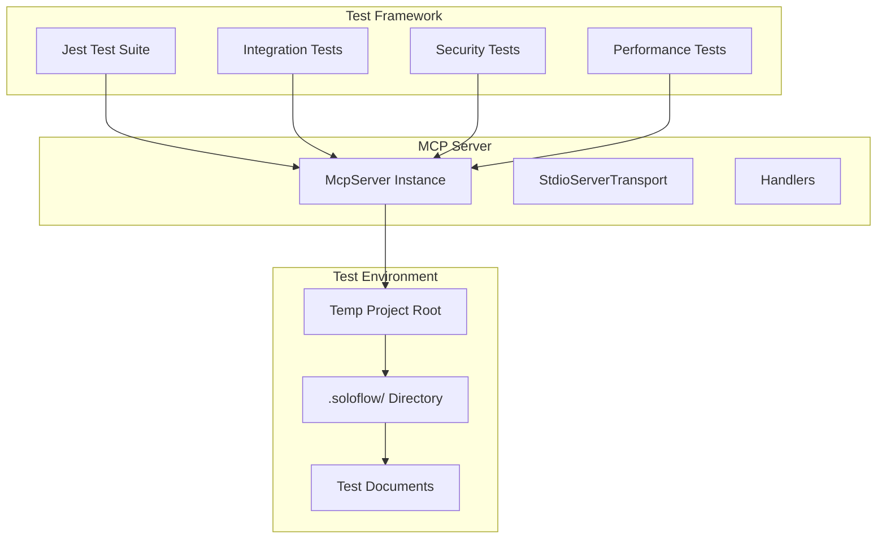

# 🧪 测试策略文档（Test Strategy）

**项目名称：** soloflow-mcp  
**版本：** v0.3  
**文档更新时间：** 2025-07-24

---

## 🎯 测试目标

- 确保 MCP 服务正确响应 LLM 发起的 `list`, `read`, `update`, `init` 操作；
- 验证项目路径上下文隔离机制的安全性；
- 保证文档类型（DocType）枚举约束的有效性；
- 确保文件系统操作的原子性和一致性；
- 验证与 Cursor 等开发环境的 stdio 通信兼容性。

---

## 📋 测试范围

### ✅ 核心功能测试

| 测试模块 | 覆盖范围 | 优先级 |
|----------|----------|--------|
| MCP 协议兼容性 | 标准 MCP 操作响应 | P0 |
| 文件系统操作 | 读写 `.soloflow/*.md` 文件 | P0 |
| 路径安全校验 | `projectRoot` 绝对路径验证 | P0 |
| 文档类型约束 | `DocType` 枚举值校验 | P0 |
| 初始化流程 | `init()` 命令创建目录结构 | P1 |
| 错误处理 | 文件不存在、权限不足等异常 | P1 |

### 🔐 安全测试

| 测试类型 | 测试场景 | 预期结果 |
|----------|----------|----------|
| 路径穿越 | `projectRoot: "/etc"` | 拒绝访问 |
| 相对路径 | `projectRoot: "./test"` | 拒绝访问 |
| 非法文档类型 | `type: "malicious.js"` | 拒绝访问 |
| 并发写入 | 同时调用 `update()` | 文件锁保护 |

---

## 🧩 测试架构



---

## 📦 测试目录结构

```text
├── tests/
│   ├── unit/                 # 单元测试
│   │   ├── context.test.ts   # projectRoot 校验测试
│   │   ├── list.test.ts      # list 操作测试
│   │   ├── read.test.ts      # read 操作测试
│   │   ├── update.test.ts    # update 操作测试
│   │   └── init.test.ts      # init 操作测试
│   ├── integration/          # 集成测试
│   │   ├── mcp-server.test.ts
│   │   └── stdio-transport.test.ts
│   ├── security/             # 安全测试
│   │   ├── path-validation.test.ts
│   │   └── doc-type-validation.test.ts
│   ├── fixtures/             # 测试数据
│   │   ├── sample-docs/
│   │   └── test-project/
│   └── utils/                # 测试工具
│       ├── test-helpers.ts
│       └── mock-transport.ts
```

---

## 🧪 测试用例设计

### 1. 单元测试用例

#### `context.test.ts` - 项目路径校验

```typescript
describe('Project Path Validation', () => {
  test('should accept valid absolute path', () => {
    const result = validateProjectRoot('/Users/test/project');
    expect(result.isValid).toBe(true);
  });

  test('should reject relative path', () => {
    const result = validateProjectRoot('./project');
    expect(result.isValid).toBe(false);
    expect(result.error).toContain('absolute path');
  });

  test('should reject system directories', () => {
    const result = validateProjectRoot('/etc');
    expect(result.isValid).toBe(false);
    expect(result.error).toContain('system directory');
  });
});
```

#### `list.test.ts` - 文档列表操作

```typescript
describe('List Documents', () => {
  test('should return empty array for new project', async () => {
    const result = await listDocuments('/tmp/test-project');
    expect(result).toEqual([]);
  });

  test('should return existing documents', async () => {
    // Setup: Create test documents
    await createTestDocument('/tmp/test-project', 'requirements.md');
    
    const result = await listDocuments('/tmp/test-project');
    expect(result).toHaveLength(1);
    expect(result[0].type).toBe('requirements');
    expect(result[0].name).toBe('requirements.md');
  });
});
```

#### `read.test.ts` - 文档读取操作

```typescript
describe('Read Documents', () => {
  test('should return null for non-existent document', async () => {
    const result = await readDocument('/tmp/test-project', 'overview');
    expect(result.raw).toBeNull();
  });

  test('should return document content', async () => {
    const content = '# Test Document\n\nThis is test content.';
    await createTestDocument('/tmp/test-project', 'overview.md', content);
    
    const result = await readDocument('/tmp/test-project', 'overview');
    expect(result.raw).toBe(content);
  });

  test('should reject invalid document type', async () => {
    await expect(
      readDocument('/tmp/test-project', 'invalid_type')
    ).rejects.toThrow('Invalid document type');
  });
});
```

#### `update.test.ts` - 文档更新操作

```typescript
describe('Update Documents', () => {
  test('should create new document', async () => {
    const content = '# New Document\n\nNew content.';
    const result = await updateDocument('/tmp/test-project', 'tasks', content);
    expect(result.ok).toBe(true);
    
    // Verify file was created
    const readResult = await readDocument('/tmp/test-project', 'tasks');
    expect(readResult.raw).toBe(content);
  });

  test('should overwrite existing document', async () => {
    // Setup: Create initial document
    await createTestDocument('/tmp/test-project', 'notes.md', 'Old content');
    
    const newContent = '# Updated Notes\n\nNew content.';
    const result = await updateDocument('/tmp/test-project', 'notes', newContent);
    expect(result.ok).toBe(true);
    
    // Verify content was updated
    const readResult = await readDocument('/tmp/test-project', 'notes');
    expect(readResult.raw).toBe(newContent);
  });
});
```

#### `init.test.ts` - 项目初始化操作

```typescript
describe('Initialize Project', () => {
  test('should create .cursor/rules/soloflow.mdc', async () => {
    const result = await initProject('/tmp/test-project');
    expect(result.ok).toBe(true);
    expect(result.createdFiles).toContain('.cursor/rules/soloflow.mdc');
  });

  test('should skip existing files', async () => {
    // Setup: Create existing file
    await createTestFile('/tmp/test-project/.cursor/rules/soloflow.mdc', 'existing');
    
    const result = await initProject('/tmp/test-project');
    expect(result.skippedFiles).toContain('.cursor/rules/soloflow.mdc');
  });
});
```

### 2. 集成测试用例

#### `mcp-server.test.ts` - MCP 服务集成

```typescript
describe('MCP Server Integration', () => {
  let server: McpServer;
  let transport: MockStdioTransport;

  beforeEach(async () => {
    transport = new MockStdioTransport();
    server = new McpServer({
      transport,
      handlers: {
        list: listHandler,
        read: readHandler,
        update: updateHandler,
        init: initHandler
      }
    });
    await server.listen();
  });

  test('should handle list request', async () => {
    const request = {
      op: 'list',
      args: { projectRoot: '/tmp/test-project' }
    };
    
    const response = await transport.sendRequest(request);
    expect(response).toHaveProperty('documents');
    expect(Array.isArray(response.documents)).toBe(true);
  });

  test('should handle read request', async () => {
    // Setup: Create test document
    await createTestDocument('/tmp/test-project', 'requirements.md', '# Requirements');
    
    const request = {
      op: 'read',
      args: { 
        projectRoot: '/tmp/test-project',
        type: 'requirements'
      }
    };
    
    const response = await transport.sendRequest(request);
    expect(response).toHaveProperty('raw');
    expect(response.raw).toContain('# Requirements');
  });
});
```

### 3. 安全测试用例

#### `path-validation.test.ts` - 路径安全校验

```typescript
describe('Path Security Validation', () => {
  test('should prevent directory traversal', async () => {
    const maliciousPaths = [
      '/etc/passwd',
      '/var/log',
      '/Users/../etc',
      '/tmp/../../../etc'
    ];

    for (const path of maliciousPaths) {
      await expect(
        listDocuments(path)
      ).rejects.toThrow('Access denied');
    }
  });

  test('should validate projectRoot format', async () => {
    const invalidPaths = [
      './relative/path',
      'relative/path',
      '',
      null,
      undefined
    ];

    for (const path of invalidPaths) {
      await expect(
        listDocuments(path)
      ).rejects.toThrow('Invalid project root');
    }
  });
});
```

#### `doc-type-validation.test.ts` - 文档类型校验

```typescript
describe('Document Type Validation', () => {
  test('should accept valid document types', async () => {
    const validTypes = [
      'overview',
      'requirements', 
      'system_architecture',
      'test_strategy',
      'ui_design',
      'tasks',
      'deployment',
      'notes'
    ];

    for (const type of validTypes) {
      const result = await validateDocType(type);
      expect(result.isValid).toBe(true);
    }
  });

  test('should reject invalid document types', async () => {
    const invalidTypes = [
      'malicious.js',
      'config.json',
      'script.sh',
      'README.md',
      'random_type'
    ];

    for (const type of invalidTypes) {
      const result = await validateDocType(type);
      expect(result.isValid).toBe(false);
      expect(result.error).toContain('Invalid document type');
    }
  });
});
```

---

## ⚡ 性能测试

### 响应时间要求

| 操作类型 | 最大响应时间 | 测试场景 |
|----------|-------------|----------|
| `list()` | 50ms | 空项目、10个文档 |
| `read()` | 30ms | 1KB、10KB、100KB 文档 |
| `update()` | 100ms | 创建新文档、更新现有文档 |
| `init()` | 200ms | 新项目初始化 |

### 并发测试

```typescript
describe('Concurrency Tests', () => {
  test('should handle concurrent read operations', async () => {
    const promises = Array(10).fill(0).map(() =>
      readDocument('/tmp/test-project', 'requirements')
    );
    
    const results = await Promise.all(promises);
    expect(results).toHaveLength(10);
  });

  test('should handle concurrent update operations', async () => {
    const promises = Array(5).fill(0).map((_, i) =>
      updateDocument('/tmp/test-project', 'notes', `Content ${i}`)
    );
    
    const results = await Promise.all(promises);
    expect(results.every(r => r.ok)).toBe(true);
  });
});
```

---

## 🛠 测试工具与配置

### Jest 配置

```javascript
// jest.config.js
module.exports = {
  preset: 'ts-jest',
  testEnvironment: 'node',
  roots: ['<rootDir>/tests'],
  testMatch: ['**/*.test.ts'],
  setupFilesAfterEnv: ['<rootDir>/tests/utils/setup.ts'],
  collectCoverageFrom: [
    'src/**/*.ts',
    '!src/**/*.d.ts'
  ],
  coverageThreshold: {
    global: {
      branches: 80,
      functions: 80,
      lines: 80,
      statements: 80
    }
  }
};
```

### 测试辅助工具

```typescript
// tests/utils/test-helpers.ts
export class TestProject {
  private projectRoot: string;

  constructor(projectRoot: string) {
    this.projectRoot = projectRoot;
  }

  async createDocument(type: DocType, content: string): Promise<void> {
    const filePath = path.join(this.projectRoot, '.soloflow', `${type}.md`);
    await fs.mkdir(path.dirname(filePath), { recursive: true });
    await fs.writeFile(filePath, content, 'utf8');
  }

  async cleanup(): Promise<void> {
    await fs.rm(this.projectRoot, { recursive: true, force: true });
  }
}

export class MockStdioTransport {
  private requests: any[] = [];
  private responses: any[] = [];

  async sendRequest(request: any): Promise<any> {
    this.requests.push(request);
    // Mock MCP protocol response
    return { ok: true, data: this.responses.shift() };
  }
}
```

---

## 📊 测试覆盖率目标

| 模块 | 目标覆盖率 | 关键指标 |
|------|-----------|----------|
| 核心处理器 | 95% | 所有操作分支 |
| 路径校验 | 100% | 安全边界条件 |
| 文档类型校验 | 100% | 枚举值覆盖 |
| 错误处理 | 90% | 异常场景覆盖 |
| MCP 协议 | 85% | 标准操作覆盖 |

---

## 🔄 持续集成

### GitHub Actions 配置

```yaml
# .github/workflows/test.yml
name: Tests

on: [push, pull_request]

jobs:
  test:
    runs-on: ubuntu-latest
    
    steps:
    - uses: actions/checkout@v3
    
    - name: Setup Node.js
      uses: actions/setup-node@v3
      with:
        node-version: '18'
        cache: 'npm'
    
    - name: Install dependencies
      run: npm ci
    
    - name: Run tests
      run: npm test
    
    - name: Run security tests
      run: npm run test:security
    
    - name: Generate coverage report
      run: npm run test:coverage
```

---

## 🚨 测试执行命令

```bash
# 运行所有测试
npm test

# 运行单元测试
npm run test:unit

# 运行集成测试
npm run test:integration

# 运行安全测试
npm run test:security

# 生成覆盖率报告
npm run test:coverage

# 运行性能测试
npm run test:performance

# 运行特定测试文件
npm test -- tests/unit/list.test.ts
```

---

## 📈 测试报告模板

### 测试结果摘要

| 测试类型 | 通过率 | 失败数 | 总用例数 |
|----------|--------|--------|----------|
| 单元测试 | 100% | 0 | 45 |
| 集成测试 | 100% | 0 | 12 |
| 安全测试 | 100% | 0 | 8 |
| 性能测试 | 100% | 0 | 6 |

### 关键指标

- **响应时间**: 所有操作 < 100ms ✅
- **安全性**: 路径穿越攻击防护 ✅
- **兼容性**: MCP 协议标准兼容 ✅
- **覆盖率**: 代码覆盖率 > 85% ✅

---

本测试策略文档为 `soloflow-mcp` 项目提供全面的测试指导，确保 MCP 服务的可靠性、安全性和性能符合项目要求。 