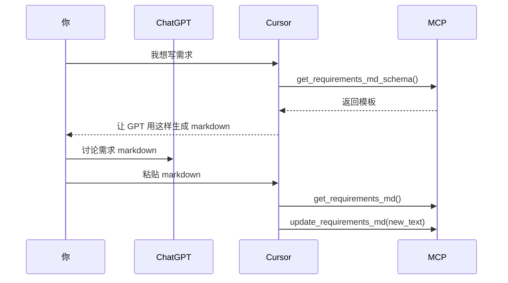

# 🧾 solo-flow-mcp 需求分析文档

## 一、项目背景与目标

**solo-flow-mcp** 是一个面向独立开发者和一人公司设计的轻量级 Markdown Context Protocol (MCP) 工具集，目标是配合 ChatGPT + Cursor 开发流程，提供文档维护与项目进展追踪能力，培育一种最大自由度、最小依赖的项目管理方式。

---

## 二、工作流程转换

### 原有流程

1. 和 ChatGPT 讨论需求
2. 讨论系统架构
3. 抓紧拆解任务
4. 手动写成 markdown 文档
5. 生成 .cursor/rules/\*.mdc
6. 开始开发，维护 docs/\*.md
7. 项目进展中迭代更新

### 拟定方式

1. Cursor 调用 MCP get\_\*\_md\_schema()，提示 GPT 生成 markdown
2. 你和 ChatGPT 对话，产生格式化 markdown
3. Cursor 分析 markdown，调用 MCP update\_\*\_md()
4. 项目进展中，调用 MCP get\_\*\_md() 读取文档，帮助 GPT 产生 plan/code
5. 完成后，更新 tasks.md/需求.md/架构.md 等

---

## 三、文档类型与路径

| 模块   | Markdown 文件路径        | tool prefix        |
| ---- | -------------------- | ------------------ |
| 需求   | docs/requirements.md | requirement\_tool  |
| 任务   | docs/tasks.md        | task\_tool         |
| 架构   | docs/architecture.md | architecture\_tool |
| 开发日志 | docs/logs/\*.md      | log\_tool          |
| 测试   | docs/test\_plan.md   | test\_tool         |

---

## 四、文档结构 schema 指导

### requirements.md

```md
# 📌 项目目标

---

# ✅ 功能需求
- [REQ-001] xxx

---

# 📜 Notes
```

### tasks.md

```md
# 🗂️ 当前任务
## 已完成
- [TASK-001] xxx

---
# 🔗 Notes
- 关联 REQ-001
```

### architecture.md

```md
# 🏗️ 系统架构概述

---

# 📦 模块列表

---

# 🧠 技术约定
```

### logs/{label}.md

```md
# 🤪 Dev Log - xxx
## 摘要
## 改动
## 思考 / 问题
## 关联 TASK-xxx
```

### test\_plan.md

```md
# 📝 测试总览

- 测试目标
- 分层策略 (unit / api / e2e)

---
# 模块测试列表
## Frontend
- [TEST-001] xxx

## Backend
- [TEST-010] xxx

---
# 📍 策略记录
- 优先级
- 要求 coverage > 80%
```

---

## 五、MCP Tool API 接口

### 通用应用

* get\_\*\_md()
* update\_\*\_md(new\_text)
* get\_\*\_md\_schema()

### 特殊为 tasks/test\_tool 增加

* get\_next\_task()
* get\_test\_for\_module(module)
* mark\_task\_done(task\_id)

---

## 六、推荐使用流程



---

## 七、扩展设计

| 方向               | 说明                              |
| ---------------- | ------------------------------- |
| .cursor/rules 生成 | 根据 REQ/TASK 生成 MDC              |
| 无独化 CLI          | 支持 get/update 快捷命令              |
| 日志管理             | 支持 logs/resume\_upload.md 方式    |
| 配合开发流程           | 支持 TDD/非 TDD 模式                 |
| 模块级测试任务          | 任务分层划分 unit/api/e2e             |
| GPT Schema Hint  | 各 md\_schema 作为 GPT prompt 格式指导 |

---

## 八、结论

solo-flow-mcp 展示了一种最简最自由的项目文档模型：

* 培育一个文档即为策略的开发思维
* 允许在与 GPT 对话中构建、描述、进化
* 最终由 MCP 维护 markdown 作为项目的中心信息源

它不是项目管理系统，也不是无限强的 AI agent，而是一个清晰、非麽的你本人同步化与迭代的助手。
