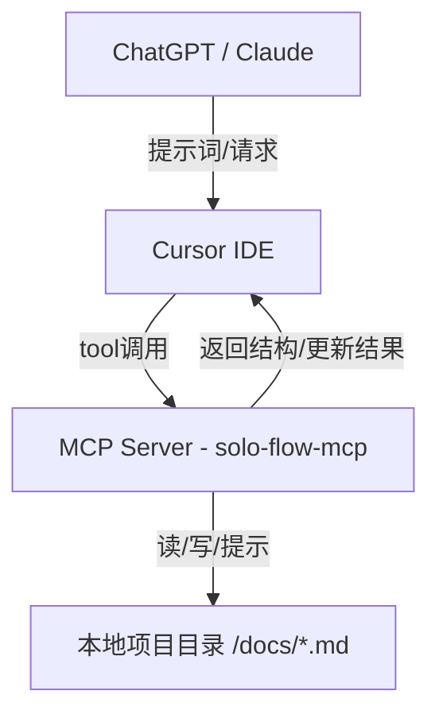
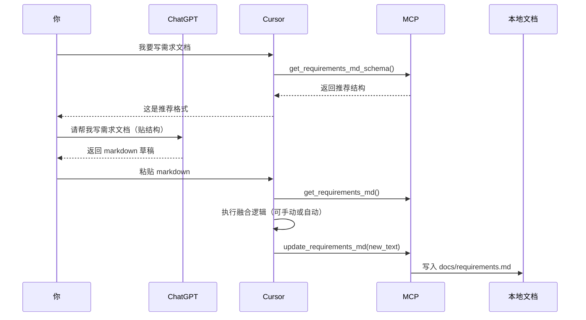

# 🏗️ solo-flow-mcp 系统架构文档

solo-flow-mcp 是为独立开发者和小型团队设计的轻量级 MCP（Model Context Protocol）服务器，基于 Markdown 文件构建项目上下文，以 ChatGPT / Claude + Cursor 等工具为核心协作者，实现 AI 驱动的文档演化与开发流管理。

---

## 🎯 一、系统目标

- 提供一个 MCP Server，专注于项目的需求、任务、架构、日志、测试等 Markdown 文件的读写
- 强调非结构化为主，结构化为辅的文档实践，兼容对话生成与标准化 Schema
- 支持 LLM 工具（如 Cursor）与 MCP 工具之间的低耦合整合，帮助开发者从"对话"中自然演化项目

---

## 🧭 二、设计原则

| 设计维度 | 原则说明 |
|---------|---------|
| 🔓 最小约束 | 文档为 Markdown，自由表达优先 |
| 📐 Schema 提示 | 提供推荐结构，不强制限制 |
| 🤖 AI 协同友好 | 结合 prompts 引导 GPT 输出规范文档 |
| 🧰 工具即函数 | 所有操作暴露为 MCP 工具函数（tool） |
| 🧾 文档为真源 | .md 是唯一的数据源，所有工具围绕文档运行 |
| 🌲 项目根识别 | 通过 MCP roots 概念识别当前目录结构 |

---

## 📁 三、系统结构概览



---

## ⚙️ 四、核心模块划分

### 1️⃣ 文档模块

| 类型 | 路径 | 说明 |
|------|------|------|
| 需求文档 | `docs/requirements.md` | 项目目标 + 功能需求列表 + 附注 |
| 任务列表 | `docs/tasks.md` | todo/in-progress/done 的任务结构 |
| 架构文档 | `docs/architecture.md` | 模块设计 + 接口规范 |
| 日志记录 | `docs/logs/*.md` | 按提交或阶段命名，记录开发历程 |
| 测试策略 | `docs/test.md` | 测试分层策略、TDD 计划、覆盖目标等 |

### 2️⃣ MCP 工具接口（Tools）

| 工具名 | 说明 |
|--------|------|
| `get_<type>_md()` | 获取某个文档的完整 Markdown |
| `update_<type>_md(text)` | 用新 Markdown 更新文档 |
| `get_<type>_md_schema()` | 返回推荐结构 Schema |
| `append_log_entry(text)` | 在日志中追加新条目 |
| `list_tasks(status)` | 获取指定状态的任务列表 |
| `sync_task_status(id, new_status)` | 更新任务状态 |
| `extract_json_from_md()`（可选） | 从 Markdown 中提取结构化 JSON（辅助生成 rules） |

### 3️⃣ Prompts（预设提示词）

| Prompt 名称 | 功能 | 绑定目标 |
|-------------|------|----------|
| `generate_requirements` | 初始化项目需求 | GPT |
| `generate_tasks_from_req` | 生成任务清单 | GPT |
| `generate_architecture_plan` | 输出系统架构初稿 | GPT |
| `generate_test_strategy` | 编写测试策略文档 | GPT |
| `write_cursor_rules` | 生成 cursor .mdc 规则 | GPT |

这些 prompts 可作为 `prompts/*.txt` 或作为 MCP Prompt API 提供。

---

## 🌲 五、项目根目录识别（Roots）

利用 MCP 标准中 roots 概念，将项目根目录传递给 MCP Server。Cursor 会将当前项目路径以环境变量或命令参数传递给 server：

```bash
SOLO_MCP_ROOT=/path/to/your/project
```

server 内部通过读取该环境变量或默认根路径下的 `docs/` 目录执行文件读写。

---

## 🔁 六、典型使用流程



---

## 🧩 七、未来可拓展方向

| 模块 | 描述 |
|------|------|
| CLI 工具 | 一键 sync、open、diff、validate |
| Rules 生成器 | 结合结构 + prompts 输出 `.cursor/rules/*.mdc` |
| Workspace 自动识别 | 多项目或多模块目录支持 |
| 文件片段级更新 | 降低冲突风险（如更新某个需求/任务） |

---

## ✅ 八、总结

solo-flow-mcp 是一个专为独立开发者设计的、Markdown 驱动的 AI 协同开发框架，兼容 MCP 标准，支持与 Cursor / Claude 等现代 LLM 工具无缝配合，能让项目文档成为 AI 驱动开发流程的"可持续语境"。

它强调：

- 📄 **文档为中心**
- 🧠 **AI 为伙伴**
- ⚒ **工具极简**
- 🤖 **Schema 可选**
- 🔁 **全链协同**
